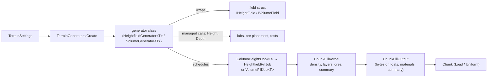
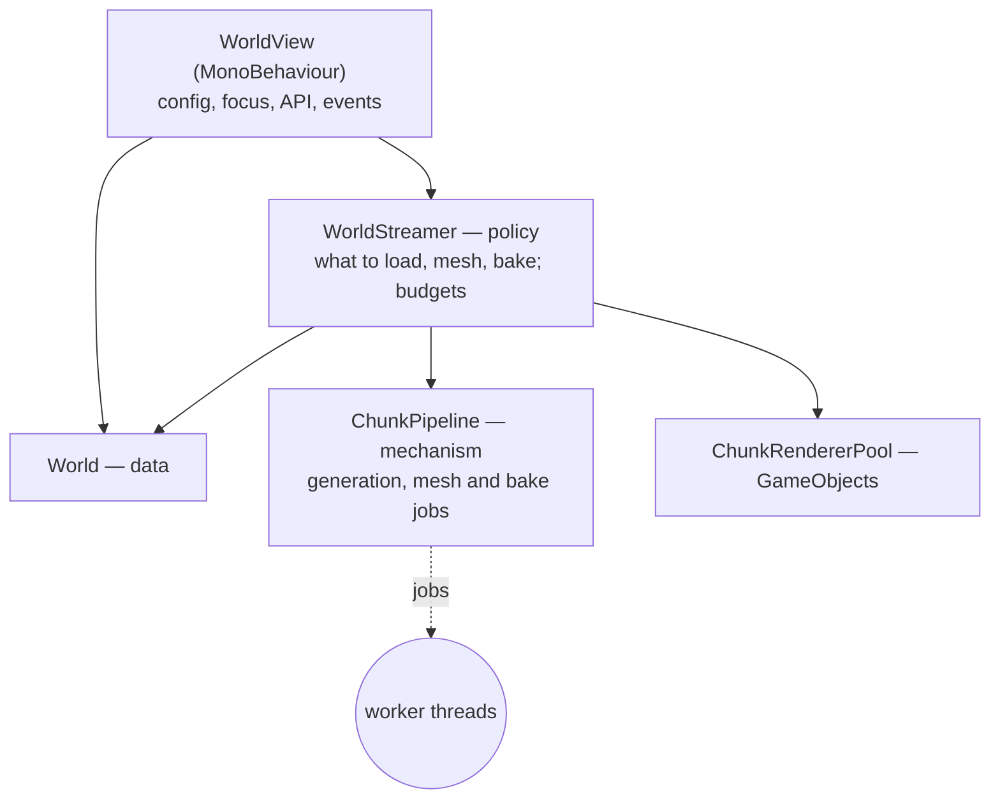
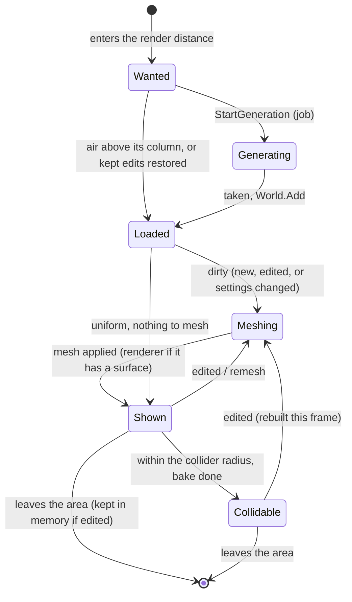

# clube — Architecture

How the code is put together, why, and where new work goes. The plan and the
rules it follows (A1–A13, G1–G5) are in [clube-objectives.md](clube-objectives.md);
measurements are in [benchmarks.md](benchmarks.md). This file is the map
between them: read it before changing how the world is generated, meshed or
streamed, or before adding a new game system.

*Written 2026-10-05, with the chunk pipeline (K35, P1–P3). Keep it current:
when a section stops matching the code, fix the section in the same PR.*

---

## 1. The big picture

Three assemblies (A1). Core is the engine; the labs and the game are both
just users of it.


Inside Core, code is grouped by **layer**, and each layer only uses the ones
below it:

| Layer | Folders | Knows about Unity objects? | Runs on |
|---|---|---|---|
| Presentation | `Rendering/` | Yes: MonoBehaviours, meshes, colliders | Main thread |
| Runtime | `Streaming/` | Mesh data and job handles only | Main thread, schedules jobs |
| Algorithms | `Generation/`, `Meshing/`, `Editing/`, `Queries/`, `Volume/` | No (structs, static code, managed reference paths) | Jobs or main thread |
| Data | `Voxels/`, `World/`, `Materials/`, `Items/`, `Config/` | Only ScriptableObjects for definitions | Main thread |

The rule that keeps this tidy: **data and algorithms never reach up.** A
`Chunk` doesn't know it is drawn; a generator doesn't know about chunks; the
streamer doesn't know about lab tools. Debug code hooks the events Core raises
(A4) — `WorldView.ChunkLoaded`, `ChunkMeshed`, `IRenderedChunk.MeshRebuilt` —
and never the other way round.

### Folder map (Core)

```
Core/
  Config/        WorldConfig (A2), ChunkSizing (M25)
  Voxels/        Chunk, IVoxelStorage + schemes (2G), VoxelMaterials (M10), VoxelArrayPool
  World/         World (loaded chunks, borders, edit paths), WorldGrid (coordinates)
  Materials/     VoxelMaterial, MaterialRegistry (M9), TerrainLayers, MaterialCensus
  Items/         ItemDefinition (O6), ToolDefinition + ToolImpact (GL1), Inventory + ItemStack (GL6)
  Generation/    TerrainSettings, ITerrainGenerator, TerrainGenerators, ChunkGenerator
    Generators/  managed generator classes (Flat, Sine, FractalPerlin2D, Spline, Perlin3D)
    Heightmaps/  Heightmap import, HeightmapGenerator, HeightmapExport (K29)
    Noise/       PerlinNoise (struct), VoxelHash
    Fields/      the Burst shapes: IHeightField / IVolumeField structs
    Fill/        generation jobs and the shared ChunkFillKernel
    Ores/        OreSpec, OreField (placement), OreRoll (the roll, shared)
  Meshing/       MarchingCubes + tables, ChunkMeshSettings, variants (A6)
    Managed/     ChunkMesher and its strategies, the managed material pass: labs, step-through (A11)
    Jobs/        ChunkMeshJob: the Burst mesh build the world runs
    Recording/   MeshingRecorder (A11)
  Editing/       TerrainBrush (K13–K16), ToolStrike + StrikeDamage (GL2–GL5), IDensityField, IEditableTerrain
  Queries/       SurfaceRaycast, VoxelRaycast, SampleSurface (GL4)
  Volume/        VoxelVolume, ChunkVolume (V11, V12, K30)
  Streaming/     ChunkPipeline (jobs), WorldStreamer (policy), StreamingArea
  Rendering/     WorldView, ChunkView, ChunkRenderer(+Pool), ChunkCollider, ChunkMeshBuilder
```

All of it is namespace `Clube.Core`; folders are for people, not the compiler.

---

## 2. Data: chunks and the world

**A chunk** (`Voxels/Chunk.cs`) is a block of `N³` voxels holding `(N+1)³`
density samples and a material id per sample. Neighbouring chunks each keep a
copy of their shared border samples; `World` keeps every copy identical (M2).

- **Storage** is behind `IVoxelStorage` (A12): flat float, flat byte (the game's
  choice, M12), run-length, octree. The streamed world uses bytes; labs keep
  floats for exact teaching values. Bulk paths: `ReadLayer` / `WriteLayer` for
  any scheme, `ByteVoxelStorage.CopyFrom/CopyTo` for one-block copies to and from
  jobs.
- **Uniform chunks.** A chunk whose samples all hold the same density (all air
  above the ground, all solid below it) keeps **no density storage** until an
  edit changes a sample (`Chunk.Uniform`, `IsUniform`). At 8 voxels/m about three
  quarters of a world's chunks are uniform. They have no surface, so no mesh, no
  renderer and no collider either (five in six chunks have no surface at all).
- **Materials** (`VoxelMaterials`) are uniform until a sample differs, the same
  idea.
- **Memory** for byte densities and material ids comes from `VoxelArrayPool`
  and goes back when the world drops a chunk (`Chunk.Release`), so a streamed
  world stops allocating once it has warmed up. *Don't use a chunk after
  releasing it.*

**The world** (`World/World.cs`) is plain data: the loaded chunks by coordinate,
the edited ones kept in memory after unloading (until saving exists, S2), and
the single edit path (A7): `SetDensity` / `SetMaterial` write every copy of a
border sample; `ApplyBrush` runs the brush on the world as one density field.
`Load` generates synchronously (labs, tests); the streamed world instead adds
chunks as their jobs finish (`Add`, `TryRestoreKept`), and a chunk added next to
an edited neighbour takes that neighbour's border values.

**Coordinates** (`WorldGrid`): world position ↔ global sample ↔ chunk ↔ local
sample, floored so negatives work. Chunks are cubes stacked in
`WorldHeightInChunks` layers from y = 0 (M17).

---

## 3. Generation (K9, K35)

One implementation of every terrain shape, used by labs and jobs alike:



- **Fields** are small structs holding everything inline (the Perlin
  permutation is 256 bytes; the spline curve is baked into a 1,001-sample
  `CurveTable`), so copying them into a job needs nothing disposed. The
  heightmap's pixels are the one native array; its generator copies them per job.
- **Heightfields** compute one height per column (`ColumnHeightsJob`), shared by
  every chunk stacked on the column; each chunk then derives its depths
  (`HeightfieldFillJob`). **Volumes** (3D) sample every point (`VolumeFillJob`).
  A managed `ITerrainGenerator` with no job form is sampled on the main thread
  (`DepthFillJob`) — slow, but it still shares the kernel.
- **The kernel** (`ChunkFillKernel`) is the only code that turns depths into
  densities, layer materials and ore, and reports whether the chunk came out
  uniform. Ore rolls use `OreRoll`, which `OreField.Pick` uses too, so the two
  can't drift.
- **Determinism** (P4, O4): every value is a pure function of position and seed,
  and positions come from integer global sample indices, so border copies agree
  exactly. Burst's float rounding differs from Mono by a few ULPs (heights
  within ~4 µm): all world chunks are generated by the same Burst code, so this
  never shows at a border. Cross-platform determinism (saves shared between
  machines, PK2) would need `FloatMode.Deterministic` — not set.

**Adding a generator:** write an `IHeightField` (or `IVolumeField`) struct in
`Fields/`; a generator class in `Generators/` deriving from
`HeightfieldGenerator<T>` (or `VolumeGenerator<T>`); one
`[assembly: RegisterGenericJobType(...)]` line in `Fill/ChunkFillJobs.cs`; a case in
`TerrainGenerators.Create` and `TerrainGeneratorType`; a test comparing the job
output with the managed calls (see `GenerationJobTests`). Nothing else changes.

---

## 4. Meshing (A6, K12, K32, M13, M15)

Two paths, same output, tested against each other (`ChunkMeshJobTests`):

| | Managed (`Meshing/Managed`) | Jobs (`Meshing/Jobs`) |
|---|---|---|
| Used by | `ChunkView` with *Mesher = Managed*; step-through (A11) | the streamed world always; `ChunkView` with *Mesher = Burst* |
| Variants (A6) | strategy objects (`IEdgeVertexPlacer`, `IVertexWriter`, `IMaterialSplitter`) | generic struct strategies (`IEdgePlacement`, `IVertexSharing`), picked once at the top of `ChunkMeshJob.Execute` |
| Materials | recovered from vertex positions afterwards (`VertexMaterialSampler`) | read from the loop: each vertex's edge's solid end |
| Output | lists, then `Mesh.SetVertices` etc. | written straight into `Mesh.MeshData`; one `ApplyAndDisposeWritableMeshData` call on the main thread |

The managed path stays because it is the readable one — the lab and the
step-through teach from it. When the two disagree, the test fails; fix whichever
is wrong, never loosen the test.

**Adding a mesh variant:** add the enum value (`MeshVariants.cs`), a strategy
for each path, and the branch at the top of `ChunkMeshJob.Execute` /
`ChunkMesher.Build`. Never test a variant per vertex.

---

## 5. Streaming: the runtime (P1–P3)

`WorldView` (the MonoBehaviour in the scene) is a façade over four parts, each
with one job:



### One frame

`WorldView.Update` → `WorldStreamer.Update(focus)`:

1. **Poll**: finished jobs move to ready queues (cheap; nothing copied yet).
2. **Area**: rebuild the wanted list when the focus crosses a chunk border
   (precomputed offsets, no sort); unload what left it (renderers back to the
   pool, unedited chunks' memory back to `VoxelArrayPool`).
3. **Apply meshes** (up to half the frame budget): hand finished mesh data to
   renderers; a chunk's first surface takes a renderer from the pool.
4. **Add chunks** (rest of the budget): copy finished generation results into
   new chunks and add them to the world.
5. **Start generation**, nearest first, up to the in-flight limit (two jobs per
   worker by default). A chunk wholly above its column's highest point is air
   without a job.
6. **Start meshing**: dirty chunks, nearest first; uniform ones need no job.
7. **Colliders**: cook shapes in jobs (`Physics.BakeMesh`) for renderers within
   the collider radius; assign finished ones; drop shapes well outside it.
8. **Flush**: start the scheduled jobs on the workers now.

Steps 3–4 always take at least one result each, so neither can starve the other,
and stop when the budget (`WorldView.frameBudgetMilliseconds`, 3 ms) runs out.
`StreamingStats.Phases` reports each step's time (the WorldView Inspector shows
it) — look there first when a frame runs long.

`WorldView.LateUpdate` → `WorldStreamer.RebuildEdited`: every chunk edited this
frame is meshed **now** (its job scheduled and waited for: a fraction of a millisecond) and, near the
focus, its collider cooked now, so digging shows and can be walked on in the
same frame.

### Threading rules

- Jobs never touch managed objects. Generation writes into buffers the pipeline
  owns; meshing reads a snapshot (`ChunkMeshInput`), so a chunk may be edited
  while its job runs — the edit re-dirties it and it is rebuilt after.
- At most one job per stage per chunk. Before a renderer's mesh changes, any bake
  reading it is finished (`FinishBakeNow`).
- A `MeshCollider` keeps its old shape when its mesh's data is replaced (checked:
  Unity doesn't re-cook it), so a stale-but-valid collider stays until the new
  bake lands.
- Native buffers that live across frames are `Allocator.Persistent`; the
  pipeline frees them when results are taken, cancelled, or on `Dispose`.
  Scene teardown only disposes the pipeline (`WorldStreamer.Dispose`), never
  renderers.

### A chunk's life



---

## 6. Labs and the game (A13)

The labs and the game share all of the above; the labs add what they need on
top, through events and `IRenderedChunk`:

- **Lab-only paths**: the managed mesher and step-through recording, the
  comparison storage schemes (float, run-length, octree), `ChunkView` for single
  chunks, every `Clube.Debug` view.
- **The game path** is what `WorldView` runs: byte storage, Burst generation and
  meshing, pooled renderers, colliders near the player.
- Lab views on a streamed world must stay cheap when not in use: `OreDebugView`
  only scans chunks while its counts or X-ray are shown; `WorldDebugView`
  rebuilds its grid at most four times a second. Follow that pattern: **a lab
  view does no per-chunk work unless it is visible.**

The lean `Game` scene (GW1–GW4) can now be built on `WorldView` directly; what
remains for GW2 is removing the variant switches the game never uses (it would
lock one edge placement, shading and material display).

### Notes on `Clube.Debug`

The lab code is in good shape where it matters most: every panel section is a
shared `*Controls` class drawn by both the panel and the Inspector (M22), and
the tools reach chunks only through `LabChunkTarget` / `IRenderedChunk` (M18).
Three things to know before it grows further:

- **`LabPanel` is the one coordinator that knows everything.** It finds 24 tools
  by type and hand-codes each section's order and visibility. When the coming
  systems bring their own lab sections (inventory, crafting, economy), turn it
  into a registry: each tool exposes a section (title, order, "available",
  draw), registers itself when enabled, and the panel just draws what's
  registered. `LabPanelEditor` then mirrors the registry instead of the list.
- **Step-through is the largest feature** (`StepThroughLab` 527 lines,
  `StepThroughVisuals` 493). It records the managed mesher only, by design
  (A11); keep it that way rather than teaching it the Burst job.
- **Lab views on a world are opt-in work.** See the rule above; `OreDebugView`
  and `WorldDebugView` show the pattern.

---

## 7. Where the next systems plug in

Notes for upcoming chapters, so new code lands in the right layer.

| Upcoming | Where it goes | Hooks that exist already |
|---|---|---|
| **M25 voxel size → LOD (P7).** At 8 voxels/m a chunk is 4 m wide, so render distance 10 is only 40 m. Seeing further needs coarser chunks far away. | `Streaming/` (which LOD a chunk column gets) + the existing jobs | Generation is a pure function of position and `ChunkSampleGrid` carries the voxel size, so a coarse chunk is the same jobs on a bigger voxel. Coarse chunks need no data kept and no colliders; seams between levels need skirts or Transvoxel. Render distance should become metres (or per-LOD rings) rather than chunks. |
| **P5 caves, P12 multi-noise terrain** | new `IVolumeField` / `IHeightField` structs in `Fields/` | A height field plus a 3D modifier can be one volume field that samples the column height; see "Adding a generator". |
| **P6 / S1–S6 save and load** | a new `Core/Persistence/` (format, versioning), called by `World` | `World.KeptChunks` and `IsEdited` say what to save; `VoxelStorages.Write/Read` serialize any scheme; run-length is the compact saved form (K26). Do file I/O in a job or a thread (S5). |
| **I5 mining → inventory, PK1 mixed ore** | `Editing/` (what was removed, per material) → `Game` (inventory) | Tools already collect: `ToolStrike.Hit` adds one drop per removed sample and `PlayerToolUser.Collected` reports it (GL5), so the inventory (GL6) subscribes there. For the brush, `BrushResult` would need removed volume per material id (the brush already reads each sample's material). |
| **N1 inventory, CR crafting, T tech tree** | plain C# data models in Core (or a new `Clube.Items` / `Clube.Economy` assembly when they grow), UI in `Clube.Game` | `ItemDefinition` (O6) is the start. Keep the models free of MonoBehaviours so they're unit-testable (G3). |
| **ST1 settlement scoring, U1 mini map** | `Generation/` queries | Column heights and `OreField.NodesInCell` answer "what's here" without generating voxels. |
| **PK9/PK10 falling terrain, PK11 explosives** | `Editing/` | Everything goes through the A7 edit path; the streamer rebuilds whatever it dirties in the same frame (`MaxEditsPerFrame` caps a huge blast; the rest follow next frame). |
| **NPCs, towns (7A, 7B)** | `Clube.Game` (behaviour), Core for anything simulated off screen | Raycasts against data (`World.Raycast`) work without colliders, for anything far from the player. |

---

## 8. Local optimization targets

Self-contained jobs for a later session: each names the code, how to measure
it, and when it's done. None needs the big picture changed. Measure with
*Clube → Benchmarks → World streaming (P3)* (frames) and *World meshing (K32)*
(stages), Burst safety checks off for real numbers; record results in
`benchmarks.md`. Rough value order.

1. **Budget the job starts too.** `WorldStreamer.StartGenerating` / `StartMeshing`
   aren't held to the frame budget (scheduling 38 jobs with their ore lookups and
   snapshots costs 1–2 ms on a busy frame). *Measure:* `StreamingStats.Phases`
   max over a load. *Done when:* p95 streamer time ≤ the budget + 0.5 ms.
2. **Dirty set instead of scans.** `StartMeshing` walks the whole wanted list and
   `RebuildEdited` the whole world every frame to find dirty chunks (fine at
   2,500 chunks, not at 20,000). Have `World` record coordinates it dirtied.
   *Done when:* both are O(dirty chunks).
3. **Pool the pipeline's native buffers.** Each generation allocates a
   `ChunkFillOutput` and ore array, each mesh job a `ChunkMeshInput`
   (`Allocator.Persistent`). Keep a few per size and reuse them. *Measure:*
   `start generation` phase; Profiler allocations.
4. **Shared-vertex lookup without hashing.** `SharedVertices` (smooth shading)
   uses a `NativeHashMap`; Marching Cubes implementations usually keep the vertex
   index of each edge for the current and previous Z slice in arrays. *Measure:*
   `MesherSpeedBenchmark`, smooth rows. *Done when:* smooth ≈ flat cost, and
   `ChunkMeshJobTests` pass.
5. **World raycast over the chunk grid.** `World.Raycast` tests every loaded
   chunk's bounds, and `SurfaceRaycast.Cast` allocates lists and a closure per
   call (the player casts every frame). Walk chunks along the ray (like
   `VoxelRaycast` over voxels) and reuse buffers. *Done when:* no allocations per
   cast, cost independent of render distance.
6. **Brush on chunk spans.** `World.ApplyBrush` goes through `IDensityField` per
   sample, each a dictionary lookup plus `ChunksContainingSample`. Precompute the
   chunks the sphere reaches and work on their local boxes; keep the soft
   brush's neighbour test seeing across borders (that's why it uses the world
   field — see `WorldTests.SoftBrush_SeesAcrossTheBorder`). *Measure:* M12's
   stroke ms at 8 voxels/m. *Done when:* ≥ 3× faster, `TerrainBrushTests` and
   `WorldTests` pass.
7. **Load what the camera sees first.** `StreamingArea` orders by distance only.
   Weight chunks in front of the camera ahead, and skip chunks below the surface
   until they're needed for meshing a neighbour or an edit.
8. **Batch collider bakes and mesh uploads.** One `IJobParallelFor` over all mesh
   ids instead of a job per mesh; one `ApplyAndDisposeWritableMeshData` for
   several meshes. *Measure:* `colliders` and `apply` phases.
9. **Smooth normals across chunk borders.** Normals are computed per chunk, so
   smooth shading can show a faint line at borders (M2 note). Give the mesh job a
   one-sample apron from neighbours and take normals from the density gradient.
10. **Parallel rows within a chunk.** `HeightfieldFillJob` and `ColumnHeightsJob`
    are single jobs; for 64³ chunks an `IJobFor` over Z slices spreads one chunk
    over workers (matters for edits and the first chunk under the player, not
    for streaming throughput).
11. **Ore collection off the main thread.** `ChunkGenerator.CollectOres` runs
    `OreField.CollectNodes` per chunk on the main thread (cached cells, but a box
    query each time). Cache per chunk column, or collect per column once.
12. **Lab census in a job.** `MaterialCensus.Count` (ore readout, X-ray) reads every
    sample through `Chunk.GetDensity`; read the storage's bytes in a Burst job.

When one of these is done, move it into `benchmarks.md` with its numbers and
delete it here.

---

## 9. Rules of thumb

- **Where does it go?** Data → `Voxels`/`World`; a pure function of data →
  an algorithm folder; anything per frame → `Streaming`; anything with a
  `GameObject` → `Rendering`; anything lab-only → `Clube.Debug`; player-facing →
  `Clube.Game`.
- **Hot paths allocate nothing per frame.** Reuse lists, pool arrays, keep native
  buffers. A collection on the Editor's heap stalls a frame for milliseconds.
- **Variants are picked once per build** (A6): a strategy object, a generic
  struct, or one switch at the top of a job.
- **Two implementations of the same thing need a test that compares them**
  (managed ↔ Burst meshing, `Pick` ↔ the kernel, generated tables ↔ the source
  tables).
- **Lab views pay nothing when hidden.**
- **Measure before and after**, with the benchmark that covers the stage, and
  write the numbers down.
